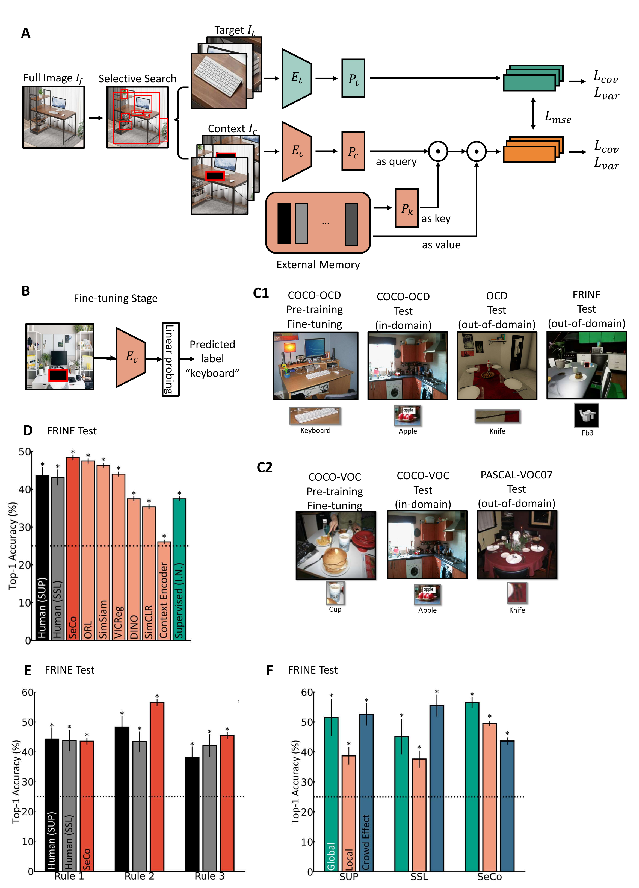
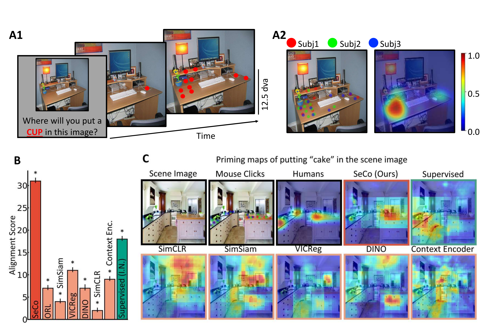

# Self-supervised Learning for Context Reasoning (SeCo)

[](https://www.python.org/downloads/)
[](https://pytorch.org/)
[](https://www.linux.org/)

## Official Pytorch Implementation of Self-supervised Learning for Context Reasoning
### Xiao Liu, Soumick Sarker, Ankur Sikarwar, Bryan Atista Kiely, Gabriel Krieman, Zenglin Shi, Mengmi Zhang



This repository for **SeCo** contains:

- human psychophysics experiment on **Human Object Priming (HOP)**,
- context-aware self-supervised model (**SeCo**) and baseline models,
- and the **statistical analyses** 

Each directory has its **own
self-contained README**. This top-level file explains how those pieces fit
together and how to reproduce the main results end-to-end.

---

## 1. Repository structure

```text
SeCo-main/
├── human_psychophysics_experiments/   # Human Object Priming (HOP) task
├── seco/                              # SeCo training & object-priming evaluation
├── statistical_analysis/              # Statistical tests
```

> Note: this directory was previously named `Human Psychophysics Experiments/`.
> All paths now use the lowercase, underscore-separated form shown above.

### 1.1 `human_psychophysics_experiments/`

Code, environment files, and download script for the **Human Object Priming
(HOP)** experiment: a psychophysics task where human observers click on likely
locations of an object in natural scenes.

- See `human_psychophysics_experiments/README.md` for:
  - a detailed description of the HOP task,
  - links to the experiment **Code** and **Data** (downloaded via
    `data_download.sh`),
  - instructions for running the online experiment via Psiturk,
  - how human priming maps are constructed from click data.

### 1.2 `seco/`

PyTorch code for training and evaluating the **SeCo** model, along with
scripts for downstream tasks including **object priming** and standard
vision benchmarks.

Typical contents:

- `main_seco.py` – self-supervised pre-training on COCO-style data,
- `dataset.py` – dataset wrapper and context manipulation utilities,
- `object_priming.py` – inference code to generate model “priming maps”
  comparable to human HOP maps,
- `eval_linear*.py` – linear evaluation on VOC / ImageNet-style tasks,
- `seco/` – model definitions (attention modules, heads, etc.),
- `seco_artifacts_download.sh` – downloads pretrained SeCo checkpoints and
  required artifacts (HOP-related features, etc.).

See `seco/README.md` for:

- dataset preparation (COCO-OCD, COCO-VOC, Pascal VOC 2007, HOP),
- how to run SeCo pre-training for different datasets,
- how to evaluate SeCo and baselines on object priming and classification
  tasks,
- how to use our pretrained checkpoints instead of training from scratch.

### 1.3 `statistical_analysis/`

Jupyter notebooks for the **statistical hypothesis tests** reported in the
paper, including tests on:

- human performance vs. chance,
- differences between human **supervised vs. self-supervised** conditions,
- model vs. human comparisons across context manipulations,
- comparisons among SeCo and baseline models,
- additional analyses on global vs. local context and crowding.

See `statistical_analysis/README.md` for:

- a detailed overview of each notebook,
- which pre-computed results they expect,
- how to download the necessary summary data via `download_data.sh`,
- guidelines for interpreting the resulting p-values, CIs, and effect sizes.

---

## 2. Getting started

### 2.1 Clone the repository

```bash
git clone https://github.com/ZhangLab-DeepNeuroCogLab/SelfSupervisedContextReasoning 
cd SeCo
```

> All paths in this README assume you are at the **repository root**
> (`SeCo/`).

### 2.2 Python environments

Different components have slightly different dependencies. A reasonable
starting point is a **conda** or **virtualenv** with:

- Python ≥ 3.8
- `numpy`, `scipy`, `scikit-learn`, `pandas`
- `matplotlib`, `jupyter`
- `torch`, `torchvision` (GPU strongly recommended)
- `opencv-python`, `Pillow`
- `xmltodict`

For the HOP psychophysics experiment, additional dependencies
(Psiturk, Flask, etc.) are listed in:

```bash
human_psychophysics_experiments/requirements.txt
```

You can install them with e.g.:

```bash
cd human_psychophysics_experiments
pip install -r requirements.txt  
```

SeCo training and evaluation does **not** have a dedicated `requirements.txt`,
but the imports in `seco/` rely on standard PyTorch + vision tooling
(`torch`, `torchvision`, `opencv-python`, etc.).

---

## 3. Reproducing the main results

Below is a high-level roadmap. Each subdirectory README contains a more
detailed, experiment-specific checklist.

### 3.1 Human Object Priming (HOP)

1. **Download HOP code and data**  
   ```bash
   cd human_psychophysics_experiments
   ./data_download.sh
   conda create -n mturkenv python=3.8
   conda activate mturkenv
   pip install --upgrade psiturk==2.3.12
   pip install -r requirements.txt  
   ```

   This script downloads the Psiturk experiment code (`Code.zip`) and
   processed priming data (`Data.zip`) to the current directory (or a
   user-specified output directory). See the subdirectory README for
   details.

2. **Inspect or re-run the experiment (optional)**  
   Follow the instructions in `human_psychophysics_experiments/README.md`
   if you want to re-host the HOP experiment and collect new participants.

3. **Human priming maps**  
   Processed HOP data (clicks) are aggregated into human “priming maps”
   describing spatial expectations for each (image, object) pair. These
   are used later when comparing humans to SeCo’s model priming maps.

4. Run the experiment in debug mode

1. Unzip `Code.zip`:

   ```bash
   unzip Code.zip
   ```

   This will create:

   ```text
   objprime_latest/
   ```

2. Start Psiturk inside that folder:

   ```bash
   cd objprime_latest
   psiturk
   ```

3. In the Psiturk shell:

   ```text
   server on
   debug
   ```

4. Open your browser at:

   - `http://localhost:22380`

   and follow the AMT-like flow locally in debug mode.

### 3.2 SeCo training and object priming evaluation

1. **Download pretrained models and artifacts (recommended)**  
   ```bash
   cd seco
   ./seco_artifacts_download.sh
   ```

   This fetches pretrained SeCo checkpoints and auxiliary files (about
   ~10GB). Using these avoids having to re-train the model from scratch.

2. **(Optional) Train SeCo from scratch**  
   To reproduce the pre-training phase, run the following commands for different datasets:

- **COCO-OCD**:  ```nohup python main_seco.py -a resnet50 --img_dir /PATH/TO/COCO/IMAGES --anno_dir annotations --epochs 500 -b 256 --dist-url 'tcp://localhost:10012' --resume 'pre-trained_models/imagenet.pth.tar' --save_dir 'checkpoints_ocd' --multiprocessing-distributed --world-size 1 --rank 0 --dataset ocd --mlp 512 --K 200 --memory_dim 512 --workers 16 > train_ocd.log 2>&1 &```
- **COCO-VOC**:  ```nohup python main_seco.py -a resnet50 --img_dir /PATH/TO/COCO/IMAGES --anno_dir annotations --epochs 500 -b 256 --dist-url 'tcp://localhost:10012' --resume 'pre-trained_models/imagenet.pth.tar' --save_dir 'checkpoints_voc' --multiprocessing-distributed --world-size 1 --rank 0 --dataset voc --mlp 512 --K 200 --memory_dim 512 --workers 16 > train_voc.log 2>&1 &```

4. **Evaluate on the HOP object priming task**  
   Use `object_priming.py` to generate model priming maps for the HOP
   dataset, using the pretrained checkpoint(s). These maps will be
   compared against human maps in the analyses.
   We have provided our pretrained models and trained linear weights for evaluation in these folders [1]([https://drive.google.com/drive/u/2/folders/1AHr_eX46uk3uSYS2CJIhRUfG_RsY1-Vv](https://drive.google.com/drive/folders/1MrEoTYzMIvodSMnhtpx7NnC5ubSWH3nD?usp=drive_link)) [2]([https://drive.google.com/drive/u/2/folders/1DmwWT3VCOkruCTs2mGSceLdD615VGB-p](https://drive.google.com/drive/folders/1hTgt301nLcf--YxcDGh76Ij8QiUsDwaI?usp=sharing)). To reproduce main results, run following commands for different datasets:

- **OCD In Domain**: ```nohup python eval_linear.py --evaluate --batch_size_per_gpu 256 --anno_dir annotations --img_train_dir /PATH/TO/COCO/TRAIN/IMAGES --img_val_dir /PATH/TO/COCO/VAL/IMAGES --dataset ocd --arch resnet50 --pretrained_weights pre-trained_models/ocd_eps500.pth.tar --linear_weights linear_weights/ocd/checkpoint_best.pth.tar  --lr 0.1 --num_labels 15 --output_dir 'eval_checkpoints_ocd' --dist_url 'tcp://localhost:10002' --gpu 0 > logs/eval_seco_ocd_indomain.log 2>&1 &```
- **OCD Out of Domain**: ```nohup python eval_linear_ocd.py --batch_size_per_gpu 256 --anno_dir /PATH/TO/OCD --img_val_dir /PATH/TO/OCD --arch resnet50 --pretrained_weights pre-trained_models/ocd_eps500.pth.tar --linear_weights linear_weights/ocd/checkpoint_best.pth.tar --num_labels 15  --dist_url 'tcp://localhost:10001' --gpu 0 > logs/eval_seco_ocd_outofdomain.log 2>&1 &```

- **VOC In Domain**: ```nohup python eval_linear.py --evaluate --batch_size_per_gpu 256 --anno_dir annotations --img_train_dir /PATH/TO/COCO/TRAIN/IMAGES --img_val_dir /PATH/TO/COCO/VAL/IMAGES --dataset voc --arch resnet50 --pretrained_weights pre-trained_models/voc_eps500.pth.tar --linear_weights linear_weights/voc/checkpoint_best.pth.tar  --lr 0.1 --num_labels 20 --output_dir 'eval_checkpoints_voc' --dist_url 'tcp://localhost:10001' --gpu 1 > logs/eval_seco_voc_indomain.log 2>&1 &```
- **VOC Out of Domain**:```nohup python eval_linear_voc07.py --batch_size_per_gpu 256 --anno_dir /PATH/TO/VOC/ANNOTATIONS  --img_val_dir /PATH/TO/VOC/VALSET --test_split_dir /PATH/TO/VOC/TESTSPLIT --arch resnet50 --pretrained_weights pre-trained_models/voc_eps500.pth.tar --linear_weights linear_weights/voc/checkpoint_best.pth.tar --num_labels 20  --gpu 2 > logs/eval_seco_voc_outofdomain.log 2>&1 &```
- **HOP**: ```nohup python eval_object_priming.py > logs/eval_seco_op.log 2>&1 &```

Details and exact argument lists live in `seco/README.md`.



### 3.3 Fribble object classification: human vs. models

The fribble experiments probe contextual reasoning in a 4-way object
classification task with controlled context manipulations.

1. **Human data**  
   Psiturk logs for the online fribble experiments live in
   `analysis_and_comparative_study/expFribble*.db` (final analyses use
   `expFribble.db`).

2. **Model results**  
   Multi-run evaluation logs for SeCo and baseline models should be
   placed in a directory pointed to by a `root = ...` variable inside
   the analysis notebooks.

3. **Analysis notebooks**  
   In `analysis_and_comparative_study/`, use:

   - `retrieve_test_results_bryan.ipynb` to parse human logs and compute
     per-condition accuracies and confusion matrices,
   - `model_results_plot.ipynb` to aggregate model results and generate
     the main comparison plots,
   - `model_results_plot_per_rule.ipynb` for per-rule breakdowns,
   - `human_model_alignment.ipynb` to quantify model–human correlations
     across context conditions,
   - `seco_variants.ipynb` for ablation analyses of SeCo.

All of these notebooks are documented in detail in
`analysis_and_comparative_study/README.md`.

### 3.4 Statistical tests

Once human and model summary statistics have been computed, the
`statistical_analysis/` notebooks perform the tests reported in the
manuscript (e.g., t-tests, ANOVAs, mixed-effects models).

1. **Download summary data (recommended)**  
   If you only want to reproduce the statistics in the paper, you can
   download the pre-computed summary data used by the notebooks:

   ```bash
   cd statistical_analysis
   ./download_data.sh
   ```

2. **Run notebooks**  
   Open the Jupyter notebooks in this directory and run them top-to-bottom.
   The README in this directory explains which notebook corresponds to
   which figure / claim, and what each test is checking.

